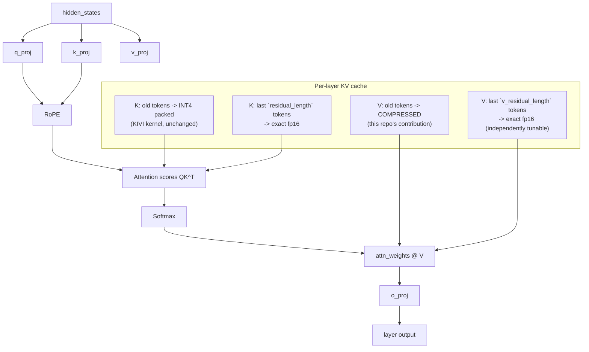
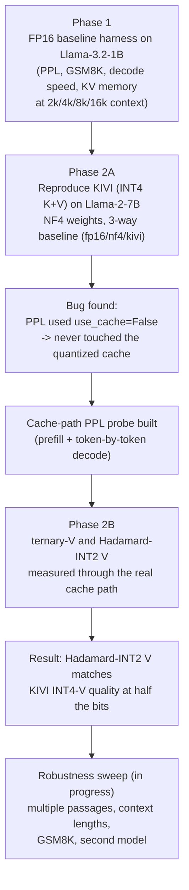

# KV-Hadamard: Honest Evaluation of Low-Bit KV-Cache Quantization

**Author: Aryan Gupta**

Research project on shrinking the LLM KV cache (the memory an autoregressive
model spends holding past Keys/Values) without losing quality. Covers a
validated FP16 baseline, a reproduced KIVI (INT4) reference, and a novel
scalar Hadamard-rotation + INT2 value-cache scheme that matches KIVI's
4-bit quality at half the bits — measured through the cache path generation
actually uses, not a blind forward pass.

## Why this exists

Long conversations blow up GPU memory because every token's Key and Value
vectors are cached for attention. On small GPUs (12GB and under), long
contexts run out of memory. The fix is to quantize/compress the KV cache —
but any such method must be checked for two things nobody checks by default:

1. Does it actually preserve output quality?
2. Was the quality test even capable of detecting the compression?

This repo's main contribution isn't just a quantization scheme — it's
catching that the standard way people measure "quality" (single forward pass,
`use_cache=False`) **never exercises the KV cache being quantized**, so it
cannot detect whether a compression method is lossy. Every result below was
re-measured after fixing that.

## Architecture

### 1. The measurement bug (why most "lossless" KV-quant claims need re-checking)

```mermaid
flowchart LR
    subgraph Blind["Blind eval (use_cache=False) — WRONG"]
        A1[Full prompt] --> B1[Single forward pass]
        B1 --> C1[Raw fp16 K/V used directly]
        C1 --> D1[Perplexity]
    end
    subgraph Real["Real eval (use_cache=True) — CORRECT"]
        A2[Prompt] --> B2[Prefill: build KV cache]
        B2 --> E2[Quantize K/V into cache]
        E2 --> F2[Decode token by token]
        F2 --> G2["Attention reads back the\nQUANTIZED cache"]
        G2 --> D2[Perplexity]
    end
    style Blind fill:#3a1414,stroke:#a33
    style Real fill:#123a1a,stroke:#3a5
```



The blind method never enters the decode loop, so quantization schemes that
only touch the *cached* K/V (KIVI, ternary, Hadamard-INT2, all below) are
invisible to it. Every scheme scored identically under the blind method —
that identical score was the bug, not a quality result.

### 2. KV-cache attention path (what actually gets quantized)



K path is byte-for-byte stock KIVI (INT4, untouched). Only the **V path** is
where this project's methods differ, isolating the comparison to one
variable.

### 3. Value-quantization schemes compared

```mermaid
flowchart LR
    V[V vector, head_dim] --> T1["Ternary\n{-1,0,+1} x scale\n~1.58 bit/elem"]
    V --> T2["Hadamard rotate\n(V x H)"]
    T2 --> T3["INT2 uniform quant\n(4 levels)\n2 bit/elem"]
    T2 --> T4["Ternary after rotation\n~1.58 bit/elem"]
    T3 --> R2["rotate back (x H)"]
    T4 --> R4["rotate back (x H)"]

    style T3 fill:#123a1a,stroke:#3a5
    style R2 fill:#123a1a,stroke:#3a5
```



The Hadamard transform is a fixed orthonormal matrix (no training) that
spreads outlier values evenly across dimensions before quantizing, letting a
coarser uniform grid fit the data with much less error — the same idea
behind QuaRot / SpinQuant. Because `H` is symmetric and orthonormal,
`H⁻¹ = H`, so rotating back after dequantization is the same matrix multiply.

### 4. Project pipeline (phases)



## Results

### Headline (single-passage probe, `probe_cache_ppl.py`, Llama-2-7B, WikiText-103)

All numbers are **cache-path PPL** (real generation path, `use_cache=True`),
NF4 weights, stock KIVI INT4 K cache in every row — only the V scheme varies.

| scheme | bits/elem (V) | fp16 shield (v_res) | PPL | vs KIVI |
|---|---|---|---|---|
| KIVI (reference, INT4 V) | 4 | 32 | 3.6595 | — |
| Ternary V | 1.58 | 32 | 3.7435 | +2.3% |
| Ternary V | 1.58 | 0 (no shield) | 3.9013 | +6.6% |
| **Hadamard + INT2 V** | **2** | 32 | **3.6548** | **−0.1% (parity)** |
| **Hadamard + INT2 V** | **2** | 0 (no shield) | **3.6786** | **+0.5%** |
| Hadamard + Ternary V | 1.58 | 0 | 3.8985 | +6.5% (no rescue) |

**Reading it:**
- The blind (`use_cache=False`) PPL was **identical (3.6416) across every
  scheme** — proof the old measurement never ran the quantized path at all.
- Plain ternary (1.58 bit) measurably loses quality vs KIVI's 4-bit, worse
  the more aggressively it's applied.
- **Hadamard rotation + INT2 (2-bit) matches KIVI's 4-bit V quality**, even
  with zero fp16 shield (hardest condition: every V token quantized). Half
  the bits, no measurable loss.
- Rotating before ternary does **not** rescue it — the failure is bit-depth
  (only 3 representable levels), not outlier distribution. This rules out
  "just rotate harder" as a fix for sub-2-bit V quantization on this model.

### Robustness sweep (`robust_sweep.py` + `resume_sweep.py`)

The single-passage result above was stress-tested across **3 disjoint
WikiText-103 passages x multiple context lengths (up to 3584, near Llama-2's
4096 window) x two models**. Every number is cache-path PPL; KIVI INT4 is the
reference in every row; only the V scheme changes.

**Llama-2-7B (cache-path PPL):**

| passage / N | kivi int4 | had-int2 v32 | had-int2 v0 | ternary v0 |
|---|---|---|---|---|
| P0 / 896  | 3.660 | **3.655** | 3.679 | 3.901 |
| P0 / 2048 | 3.840 | **3.854** | 3.952 | 4.429 |
| P1 / 896  | 5.303 | **5.380** | 5.560 | 6.143 |
| P1 / 2048 | 6.582 | **6.637** | 6.783 | 7.311 |
| P2 / 896  | 4.111 | **4.119** | 4.184 | 4.509 |
| P2 / 2048 | 4.155 | **4.153** | 4.225 | 4.556 |
| P0 / 3584 | 4.776 |     —     | 4.908 | 5.413 |

**TinyLlama-1.1B (second model, cache-path PPL):**

| passage / N | kivi int4 | had-int2 v32 | had-int2 v0 | ternary v0 | had-ternary v0 |
|---|---|---|---|---|---|
| P0 / 896  | 4.836 | **4.914** | 5.051 | 7.272 | 5.624 |
| P0 / 1792 | 4.830 | **4.916** | 5.065 | 7.164 | 5.915 |
| P1 / 896  | 7.965 | **8.083** | 8.637 | 11.742 | 10.754 |
| P1 / 1792 | 8.884 | **8.984** | 9.354 | 12.623 | 11.297 |

**What the sweep establishes:**
- **Hadamard-INT2 with a 32-token fp16 shield matches KIVI INT4 quality
  everywhere** — within ~1% on Llama-2-7B and ~2% on TinyLlama, across every
  passage and length. The single-passage headline was not a fluke.
- **Shield-free (v_res=0) Hadamard-INT2** costs a few percent (larger on the
  smaller model: up to +8% on TinyLlama vs ~+3% on 7B) — still far better than
  ternary and a usable extreme-compression point.
- **Ternary (1.58-bit) is not competitive**, and the gap *widens on the
  smaller model* (up to +50% PPL on TinyLlama) — smaller models are more
  sensitive to V precision, exactly where a KV-compression method must not
  break.
- **Rotation helps ternary more on the small model** (had-ternary 5.62 vs
  plain ternary 7.27 at TinyLlama P0/896) than on 7B (no rescue), but never
  closes the gap to INT2. Confirms the limit is bit-depth, not just outliers.

Raw per-row data: `baseline_results/robust_sweep_resumed.json` and the run
logs. The sweep is crash-resilient (per-row checkpointing in `resume_sweep.py`)
because it was developed through repeated power interruptions.

### GSM8K (honest, cache-path — but not discriminating here)

GSM8K uses `generate()`, so it genuinely exercises the quantized cache. Both
KIVI and Hadamard-INT2 scored **0/20** on Llama-2-7B. Inspection of the saved
transcripts (`baseline_results/gsm8k_transcripts_*.json`) confirms this is a
**base-model 0-shot floor**, not a harness bug: the base model produces wrong
arithmetic and degenerates into repetition loops; answer extraction works
correctly. GSM8K therefore does not discriminate between V schemes on this
base model — PPL is the operative quality metric here.

### Phase 1 baseline (Llama-3.2-1B, for methodology validation)

Established the measurement harness and killed three false "OOM" bugs
(full-vocab CE, full-sequence lm_head, O(n^2) attention fallback) before
trusting any downstream number. Validated identically on Windows and WSL.
See `PROJECT_REPORT.md` and `PHASE2_README.md` for the full writeup.

### Phase 2A (Llama-2-7B, KIVI reproduction)

| | NF4 (fp16 KV) | KIVI (INT4 KV) |
|---|---|---|
| PPL @2048 | 4.894 | 4.894 |
| KV memory @2048 | 1024 MB | 328 MB (−68%) |
| decode tok/s | 20.5 | 11.5 (~1.8x slower) |

Confirms the known KIVI result on this hardware/model before building on
top of it.

## Repository layout

```
fp16_baseline_harness.py   Phase 1 harness: PPL / GSM8K / decode speed / KV memory
                           (reused unmodified by every later phase)
phase2_kivi_harness.py     Phase 2 loaders: fp16 / nf4 / kivi baselines on Llama-2-7B
ternary_v.py               V-cache quantizers: ternary, Hadamard+INT2, Hadamard+ternary,
                           plus the monkeypatch that swaps KIVI's attention forward
probe_cache_ppl.py         Single-passage cache-path PPL probe (the bug-catching tool)
robust_sweep.py            Multi-passage / multi-length / multi-model robustness sweep
resume_sweep.py            Crash-resilient resume (per-row checkpointing) for the sweep
setup_phase2.sh            WSL environment setup (KIVI + flash-attn + pinned deps)
diag_attn*.py              Attention-implementation diagnostics (Phase 1 debugging)
PROJECT_REPORT.md          Phase 1 writeup
PHASE2_README.md           Phase 2 writeup
baseline_results/          JSON result dumps from every harness run
```

## Setup

Requires WSL (Ubuntu) with an NVIDIA GPU, CUDA toolkit + gcc-12, and a
prebuilt flash-attn wheel (source build is RAM-heavy). See
`setup_phase2.sh` for the exact pinned-version install (KIVI's kernel
requires fp16, not bf16, and an older transformers).

```bash
bash setup_phase2.sh
source ~/kvenv_phase2/bin/activate
export PYTHONPATH=$HOME/KIVI:$PYTHONPATH

python phase2_kivi_harness.py --baseline kivi   # reproduce KIVI reference
python probe_cache_ppl.py                        # single-passage cache-path check
python robust_sweep.py                           # full robustness sweep
```

## Method credit

- **KIVI** (INT4 asymmetric KV quantization): Liu et al., *KIVI: A Tuning-Free
  Asymmetric 2bit Quantization for KV Cache*, used here as the reproduced
  reference baseline via the [original KIVI implementation](https://github.com/jy-yuan/KIVI).
- **Hadamard rotation for outlier-robust low-bit quantization**: the general
  idea follows QuaRot / SpinQuant-style rotation-before-quantization; the
  application to the V-cache specifically, the cache-path evaluation
  methodology, and the ternary/Hadamard-ternary comparisons in this repo are
  original work.

## License

MIT — see `LICENSE`. Copyright (c) 2026 Aryan Gupta.
